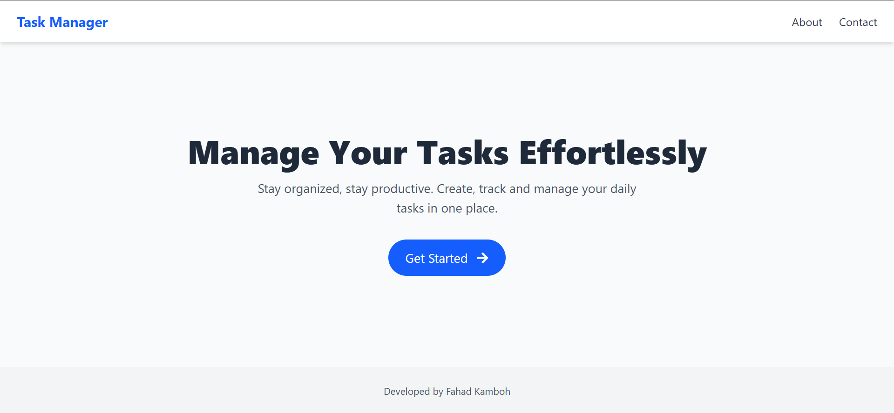
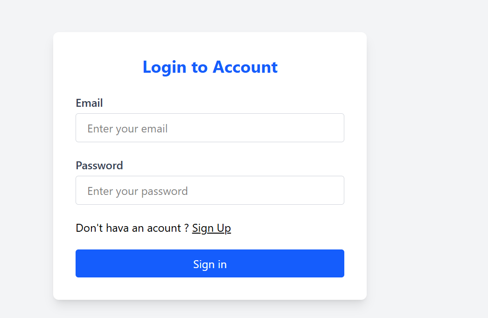
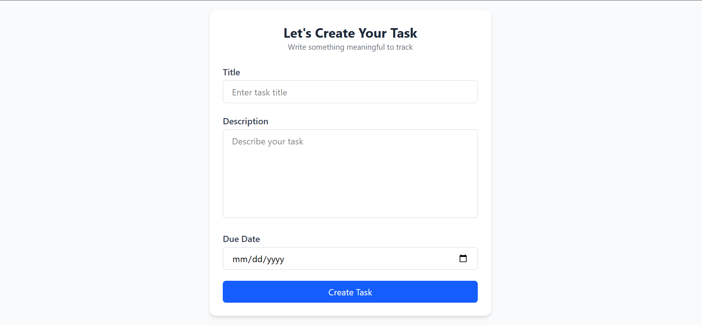

#  MERN Stack Task Manager App

This is a  Full-stack Task Management application built with the **MERN Stack (MongoDB, Express.js, React.js, Node.js)** .

---

## 📌 Objective

Build a MERN-based Task Manager App with complete authentication and CRUD features.

## 📝 Core Features

This app provides the following functionality:

- **User Registration & Login**: Secure registration and login using JWT.
- **Task Dashboard**: Logged-in users can view all their tasks.
- **Create Task**: Add new tasks with a title, description, due date, and status.
- **Edit Task**: Modify existing tasks easily.
- **Delete Task**: Remove tasks you no longer need.
- **Status Options**: Task status can be set to `pending`, `completed`, or `cancelled`.
- **Redux Toolkit**: Used for global state management.
- **React Router DOM**: For frontend routing between pages.
- **Axios**: For communicating with backend REST APIs.
- **Toast Notifications**: Helpful user feedback on actions like login, error, update, etc.

---

---

## 🚀 Live Deployment Links

- 🔗 **Frontend (Vercel)**: [https://your-frontend.vercel.app](https://task-manager-mern-liard-eight.vercel.app/)
- - 🔗 **Backend (Render / Cyclic)**: [https://your-backend.onrender.com](https://task-manager-nine-beta-62.vercel.app/)
- 📂 **GitHub Repository**: [https://github.com/yourusername/mern-task-manager](https://github.com/MuhammadFahad27/Task-Manager-)

---

## 🛠️ Tech Stack

| Technology | Description |
|------------|-------------|
| React.js   | Frontend Framework |
| Node.js    | Backend Runtime |
| Express.js | Backend Web Framework |
| MongoDB    | NoSQL Database |
| Mongoose   | ODM for MongoDB |
| Redux Toolkit | State Management |
| React Hook Form | Form Handling |
| React Router | Routing in React |
| JWT        | Authentication |
| Axios      | HTTP Requests |
| Bcrypt js      | Hashing Password |

---

##  Features

### 🔐 Authentication
- User Registration with JWT
- User Login
- Authentication & Authorization (Middleware)
- Error handling
- MongoDb Atlas 

### 📋 Task Management
- Create Task (title, description, due date, status)
- View All Tasks
- Update Task
- Delete Task

### 🧰 Additional Functionality
- React Router for Page Navigation
- Redux Toolkit for State Management
- Form Validation using React Hook Form
- Toast Notifications
- Loading States & Error Handling
- Procted Routes
---
## 📷 Screenshots

> Below are some screenshots of the application to give you a visual overview.

### 📋 Home Page

### 🛠️ Login To Account

### ➕ Create Task

---

